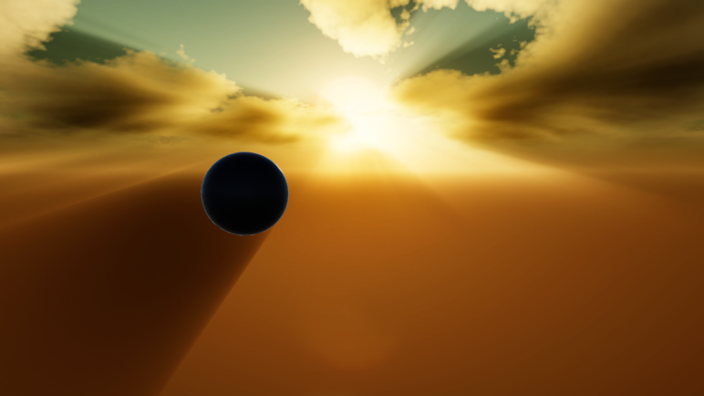

# Godrays

Godrays is an intresting visual effect noticed when the light beam is obstructued by clouds or an object.
The effect is controled by the settings below.

| Property                 | Function                                                                                                                                                                                                                                                               |
| ------------------------ | ---------------------------------------------------------------------------------------------------------------------------------------------------------------------------------------------------------------------------------------------------------------------- |
| Enabled                  | Enable state of this effect.    This is a [static](glossary#static-parameters) and [performance sensitive](glossary#performance-sensitive-parameters) parameter.                                                                                                 |
| Resolution               | The resolution of the internal render textures used for god rays rendering. Lower values are fine since rays usually blurry.    This is a [static](glossary#static-parameters) and [performance sensitive](glossary#performance-sensitive-parameters) parameter. |
| Backlighting             | Whether to render god rays when the sun is behind objects. This effect is quite inaccurate(especially for clouds) and not usually visually pleasing.                                                                                                                   |
| Blur Iterations          | The number of blur iterations applied to the god rays. Default value of `2` is fine. Adjust only if necessary (e.g noticing banding artifacts).    This is a [performance sensitive parameter](glossary#performance-sensitive-parameter)                         |
| Blur Spread              | The blur spread applied to the god rays per iteration. Use the Frame Debugger to find a good balance between 'BlurIterations' and 'BlurSpread' depending on your performance, quality and visual requirements.                                                         |
| Day Intensity            | The intensity of the rays at day time.                                                                                                                                                                                                                                 |
| Night Intensity          | The intensity of the rays at night time.                                                                                                                                                                                                                               |
| Contrast                 | The contrast of the god rays. Higher values result in more defined rays.                                                                                                                                                                                               |
| Anti-Flickering          | Whether to apply a temporal filter to the god rays to reduce flickering.                                                                                                                                                                                               |
| Anti-Flickering Strength | The strength of the anti-flickering filter. Higher values result in smoother rays but more ghosting.                                                                                                                                                                   |
| Geometry Rays Intensity  | Intensity multiplier for rays on top of a geometry.                                                                                                                                                                                                                    |
| Geometry Rays Color      | Color multiplier for rays on top of a geometry.                                                                                                                                                                                                                        |
