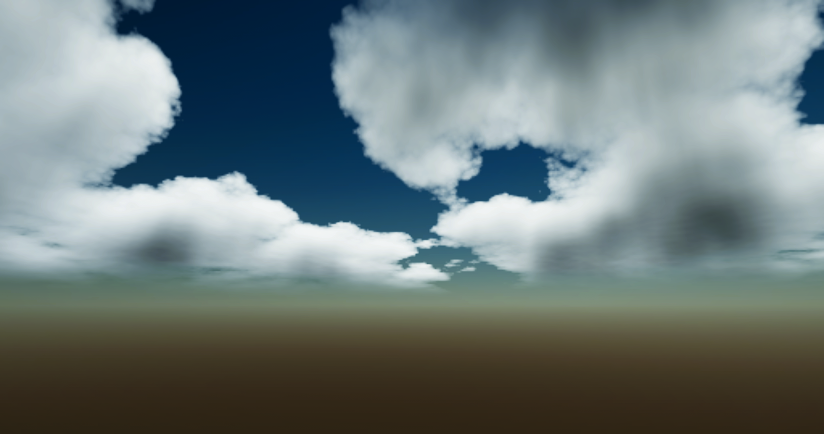

# Cloud Settings

Clouds are a key element in creating a realistic and dynamic sky. They can add depth, atmosphere, and visual interest to your scenes.

Fast Sky 2 doesn't render clouds as physically accurate volumetrics, instead it uses a faster volume-approximation technique to render the clouds. This allows for a good balance between visual quality and performance, making it suitable for a wide range of platforms and devices.

Fast Sky 2 supports up to 4 distinct cloud layers.

## Main Settings

Controls the overall rendering of all cloud layers.

| Property                    | Function                                                                                                                                                                                                                                                                                                                                                                                                                                                                   |
| --------------------------- | -------------------------------------------------------------------------------------------------------------------------------------------------------------------------------------------------------------------------------------------------------------------------------------------------------------------------------------------------------------------------------------------------------------------------------------------------------------------------- |
| Fast Mode                   | Renders the clouds at a fixed resolution of __512x512__ or less, depending on your screen size. This drastically improves performance with a very minimal quality tradeoff.                                                                                                                                                                                                                                                                                                |
| Banding Reduction           | Allows you to use a lower number of lightmarch steps for better quality-performance balance and to eliminate banding artifacts(mostly visible during sun rise/set).    When using __BandingReduction.Dither__, the cloud get jittered every frame, eliminating the banding artifacts. The jittering is usually not noticed but could be reducing by using [Temporal Anti-aliasing(TAA)](https://docs.unity3d.com/6000.3/Documentation/Manual/urp/anti-aliasing.html) |
| Render Shadows              | Enables the rendering of cloud shadows. You can control the area the cloud shadows by adding/using the [FastSkySceneConfig](setup#setting-up-the-fast-sky-component) component.    This is a [static](glossary#static-parameters) and [performance sensitive](glossary#performance-sensitive-parameters) parameter.                                                                                                                                                  |
| Shadow Resolution           | Cloud shadows resolution, lower values gives better performance with a minor quality tradeoff.  This is a [static](glossary#static-parameters) and [performance sensitive](glossary#performance-sensitive-parameters) parameter.                                                                                                                                                                                                                                     |
| Shadow Intensity            | Controls the intensity of the cloud shadows.                                                                                                                                                                                                                                                                                                                                                                                                                               |
| Night Darken Factor         | Controls the darkening of the clouds at night.                                                                                                                                                                                                                                                                                                                                                                                                                             |
| Night Absorption Multiplier | Controls the absorption of the clouds at night.                                                                                                                                                                                                                                                                                                                                                                                                                            |
| Night Opacity Multiplier    | How much the clouds' opacity is multiplied at night. Clouds closer to the moon is less influenced by this value.                                                                                                                                                                                                                                                                                                                                                           |
| Forward Scattering          | Light scattering coefficient. This is responsible for the bright, white appearance of clouds and the glare around the sun.                                                                                                                                                                                                                                                                                                                                                 |

## Cloud Layer

Each cloud layer has its own settings that controls its appearance and movement. You can use different settings for each layer to create a more dynamic and interesting sky.

| Property            | Function                                                                                                                                                                                                                                                                                                                                                                |
| ------------------- | ----------------------------------------------------------------------------------------------------------------------------------------------------------------------------------------------------------------------------------------------------------------------------------------------------------------------------------------------------------------------- |
| Enabled             | Controls the enable state of  this cloud layer.    This is a [static](glossary#static-parameters) and [performance sensitive](glossary#performance-sensitive-parameters) parameter.                                                                                                                                                                               |
| Cloud Shape         | The [cloud shape](#cloud-shape-type) used for this cloud layer.    This is a [static](glossary#static-parameters) parameter.                                                                                                                                                                                                                                      |
| Scale               | Scale of the noise texture sampling. Higher values result in smaller clouds, lower values in larger cloud shapes.                                                                                                                                                                                                                                                       |
| Coverage            | The coverage of the clouds. Higher values result in more clouds coverage.                                                                                                                                                                                                                                                                                               |
| Opacity             | Controls the opacity / transparancy of this cloud layers.                                                                                                                                                                                                                                                                                                               |
| Thickness           | The thickness of the clouds. Higher values result in smoother cloud features, but requires higher __lightmarch steps__ to look good.                                                                                                                                                                                                                                    |
| Lightmarch Steps    | The number of steps to use for lightmarching the clouds. Higher values prevents banding, but are more expensive to render. You can use the [BandingReduction](#main-settings) to minimize it. You should leave this value as 0 if you're rendering a flat cloud layer.    This is parameter is [performance sensitive](glossary#performance-sensitive-parameters) |
| Absorption          | The absorption/darkening of light as it travels through the cloud.                                                                                                                                                                                                                                                                                                      |
| Absorption Limit    | Limits the absorption effect to this threshold. This prevents completly dark clouds.                                                                                                                                                                                                                                                                                    |
| Color               | The color of the cloud layer.                                                                                                                                                                                                                                                                                                                                           |
| Light Transmittance | How much this cloud layer is affected by the atmospheric scattering. Higher values result in reddish(depending on your extinction parameters) sunrise/sunset effect.                                                                                                                                                                                                    |
| Curvature           | Controls curvature of the clouds along the atmosphere.                                                                                                                                                                                                                                                                                                                  |
| Wind Vector         | The direction and speed of the clouds.                                                                                                                                                                                                                                                                                                                                  |
| Detail Type         | The [shape](#detail-shape-type) of the detail noise. This is a [static](glossary#static-parameters) parameter.                                                                                                                                                                                                                                                          |
| Detail Scale        | The scale of the detail noise. Higher values result in smaller details.                                                                                                                                                                                                                                                                                                 |
| Detail Weight       | The erosion strength of the detail noise. Higher values result in more details.                                                                                                                                                                                                                                                                                         |
| Detail Wind Speed   | The speed of the detail noise movement relative to the 'WindVector' parameter.                                                                                                                                                                                                                                                                                          |
| Zenith Mask         | Masks the clouds towards the zenith.                                                                                                                                                                                                                                                                                                                                    |
| Horizon Mask        | Masks the clouds towards the horizon.                                                                                                                                                                                                                                                                                                                                   |
| Zenith Mask Blend   | The blend distance/sharpness of the zenith mask.                                                                                                                                                                                                                                                                                                                        |
| Horizon Mask Blend  | The blend distance/sharpness of the horizon mask.                                                                                                                                                                                                                                                                                                                       |

## Cloud Shape Type

The noise type determines the look of the cloud shapes.

| Property      | Function                                                               |
| ------------- | ---------------------------------------------------------------------- |
| Worley        | Bubbly and distinct.                                                   |
| Billow        | Much more bubbly and less distinct.                                    |
| Perlin        | Light/Less dense.                                                      |
| Value         | Dense and very distinct.                                               |
| Stratocumulus | Puffy, and lumpy cloud layers that typically look like rolling masses. |

## Detail Shape Type

| Property | Function         |
| -------- | ---------------- |
| Worley   | Bubbly.          |
| Perlin   | Smooth & Warped. |

> [!NOTE]
> Distinct in this sense means clouds formations are physically separate from each other.
